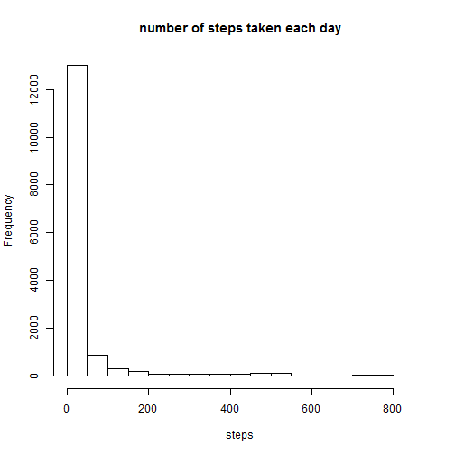
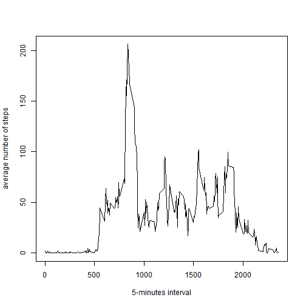
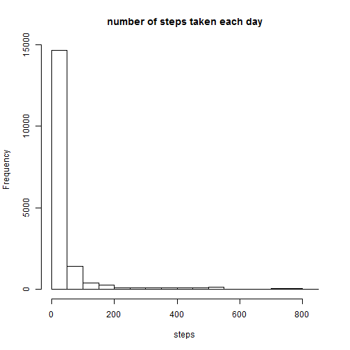
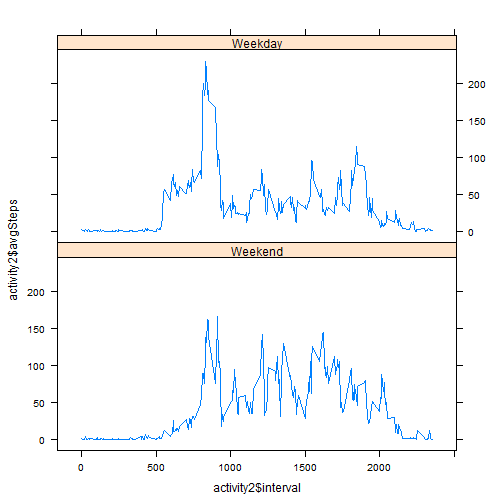

# Reproducible Research: Peer Assessment 1


## Loading and preprocessing the data


```r
setwd("C:\\Users\\gassi\\Downloads\\MOOCs\\Reproducible Research\\repdata-data-activity")
activity <- read.csv("activity.csv", header = TRUE, quote = "\"")
```


## What is mean total number of steps taken per day?

```r
hist(activity$steps, main = "number of steps taken each day", xlab = "steps")
```

 

Mean and median number of steps taken per day

```r
mean(activity$steps, na.rm = TRUE)
```

```
## [1] 37.38
```

```r
median(activity$steps, na.rm = TRUE)
```

```
## [1] 0
```

## What is the average daily activity pattern?
Plot of steps per interval

```r
essai <- tapply(activity$steps, activity$interval, mean, na.rm = TRUE)
plot(as.numeric(names(essai)), essai, type = "l", xlab = "5-minutes interval", 
    ylab = "average number of steps")
```

 

5-minute interval with the maximum number of steps taken

```r
stepsByInt <- tapply(activity$steps, activity$interval, sum, na.rm = TRUE)
mInt <- which(stepsByInt == max(stepsByInt))
attr(mInt, "names")
```

```
## [1] "835"
```

## Imputing missing values
Number of missing values

```r
as.numeric(table(is.na(activity$steps))["TRUE"])
```

```
## [1] 2304
```

New table created and missing values imputed

```r
activity1 <- activity
for (i in 1:dim(activity1)[1]) if (is.na(activity1[i, ][1])) activity1[i, ][1] = essai[as.character(activity1[i, 
    ][3])]
```

New histogram of number of steps

```r
hist(activity1$steps, main = "number of steps taken each day", xlab = "steps")
```

 

New mean and median computed

```r
mean(activity1$steps, na.rm = TRUE)
```

```
## [1] 37.38
```

```r
median(activity1$steps, na.rm = TRUE)
```

```
## [1] 0
```

The new values do not differ from the first computed before the missing values imputation.
The imputation has a slightly visible effect on the histogram made (the range of values).
It can be explained by the fact that the imputation was made using the mean number of steps by interval.
## Are there differences in activity patterns between weekdays and weekends?
New factor variable created

```r
activity1$dayType <- weekdays(as.POSIXct(activity1$date))
activity1$dayType <- as.factor(ifelse(activity1$dayType %in% c("samedi", "dimanche"), 
    "Weekend", "Weekday"))
```

Data processing before plotting

```r
# data processing before plotting
essai1 <- tapply(activity1[activity1$dayType == "Weekend", ]$steps, activity1[activity1$dayType == 
    "Weekend", ]$interval, mean, na.rm = TRUE)
noms <- names(essai1)
essai1 <- as.vector(essai1)
essai2 <- cbind(as.vector(essai1), noms, "Weekend")
essai2 <- as.data.frame(essai2)
names(essai2) <- c("avgSteps", "interval", "dayType")
essai3 <- tapply(activity1[activity1$dayType == "Weekday", ]$steps, activity1[activity1$dayType == 
    "Weekday", ]$interval, mean, na.rm = TRUE)
noms <- names(essai3)
essai3 <- as.vector(essai3)
essai4 <- cbind(as.vector(essai3), noms, "Weekday")
essai4 <- as.data.frame(essai4)
names(essai4) <- c("avgSteps", "interval", "dayType")
activity2 <- rbind(essai2, essai4)
activity2$avgSteps <- as.numeric(as.character(activity2$avgSteps))
activity2$interval <- as.numeric(as.character(activity2$interval))
```

Plotting at long last

```r
library(lattice)
```

```
## Warning: package 'lattice' was built under R version 3.0.3
```

```r
xyplot(activity2$avgSteps ~ activity2$interval | activity2$dayType, layout = c(1, 
    2), type = "l")
```

 

